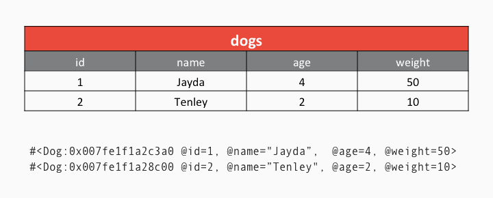
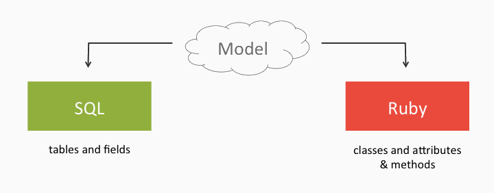
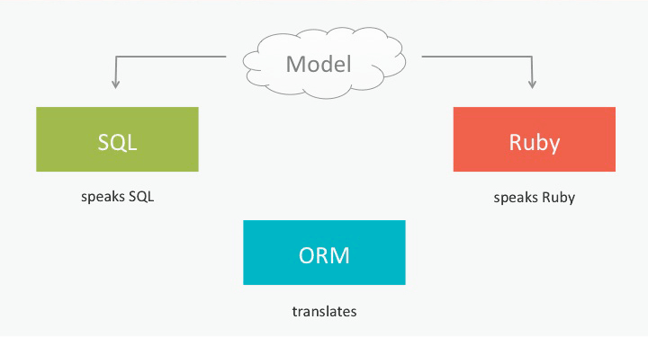

# ORM: Object Relational Mappers

## Introducción

Hemos practicado hasta ahora como modelar el mundo real tanto en ruby como en bases de datos relacionales. En la tierra de SQL modelamos el estado los datos de nuestro sistema van a vivir, de modo que puedan persistir. En la tierra de ruby queremos usar esos datos para crear nuestros modelos. No solamente queremos obtener los datos de la base de datos, también queremos crear objetos a partir de ella.

De la misma manera que hemos parseado texto dentro de archivos `.csv` o `.txt` en `Person`, `Task`, `questions` y `answers` en objetos de Ruby, los datos dentro de la base de datos deben ser convertidos a objetos de Ruby. Por ejemplo los registros de en un tabla `dogs` se deben convertir en instancias de la clase `Dog` en Ruby.



*Figura 1.* Instancias de `Dog` creadas a partir de la información en la base de datos.

La figura 1 nos muestra dos instancias de la clase `Dog` que fueron creadas a partir de la tabla `dogs`. Recuerda este es el mapeo entre la tierra de SQL y la tierra de Ruby:

- Clases en Ruby -> Tablas en la base de datos
- Instancias de la clase -> Filas en la tabla
- Variables de instancia -> Columnas de la tabla

Como hacemos para que nuestro programa de Ruby obtenga estos objetos y la base de datos sus registros?. Para esto usamos algo llamado un *Object Relational Mapper* (ORM). Un ORM es un pedazo de software que mapea los datos de un base de datos a objetos que queremos en el lenguaje de programación.  

## Traduciendo SQL y Ruby



*Figura 2.*  



*Figura 3.*  ORM traduciendo de sql a ruby y devuelta a sql

## Donde esta el ORM?

Cuando tomamos los datos de un `.csv` y lo convertimos en objetos de Ruby, hacemos uso de la clase `CSV`. Esta clase nos permite leer y escribir fácilmente a un archivo .csv, pero no crea los objetos. En este caso nos tocaba a nosotros crear métodos que crearan estos objetos.

```ruby
# Modulo para parsear CSV
module Parsing
  require 'csv'

  def parse_csv(filename)
    CSV.readlines(filename, headers: true).map do |object_data|
      self.new(object_data)
    end
  end
end

class Recipe
  extend Parsing

  def initialize(args)
    # assign instance variables
  end
end
```

*Figura 4.* La clase `Recipe` recibe la capacidad de crear objetos a partir de un csv.

En esencia, acá escribimos un pequeño ORM. La lógica de como hacer el mapeo vive dentro del método  `Parsing::parse_csv`.

De igual manera, cuando construimos un ORM para comunicarnos con una base de datos. Vamos a estar dependiendo de una librería que nos permita hablara con la base de datos. En nuestro caso esta sera el gem [sqlite3](https://rubygems.org/gems/sqlite3). Este realiza las mismas funciones que tenia la clase `CSV` pero con una base de datos.

Ahora es nuestro trabajo escribir los métodos que le dicen al objeto `SQLite3::Database` como interactuar con la base de datos. El gem sacara los datos de la base de datos y nosotros los convertiremos en los objetos de Ruby apropiados.

```ruby
require "sqlite3"

# Set up database connection; creates database file if it doesn't exist
$db = SQLite3::Database.new("animal_shelter.db", results_as_hash: true)

# Create dogs table
$db.execute <<SQL
CREATE TABLE dogs (
id INTEGER AUTO_INCREMENT PRIMARY KEY,
name VARCHAR(64),
age INTEGER,
weight INTEGER);
SQL
```

*Figura 5.*

En el caso de los ejemplos de perros, podemos crear una base de datos `dogs` usando el código de la figura 5. En este punto podemos usar el objeto `$db` para ejecutar las consultas de SQl dentro de nuestros métodos.

Hay algunos método que vamos a querer escribir. Un método que devuelva todos los perros. Otro que devuelva solo los perros que cumplan cierta condición. Un método que devuelva un perro en especifico. Un método para crear nuevos perros.

```ruby
class Dog

  def self.all
    data_rows = $db.execute("SELECT * FROM dogs;")
    data_rows.map { |dog_data| Dog.new(dog_data) }
  end

  def initialize(args)
    @id = args[:id]
    @name = args[:name]
    @age = args[:age]
    @weight = args[:weight]
  end
end
```

*Figura 6.*  Un método de ejemplo de como devolver todos los registros de la base de datos y convertirlos en objetos de Ruby.  

La figura 6 es un ejemplo del método `Dog::all`. Nota algunas cosas. Primero, es un método de clase. La clase `Dog` es responsable ella misma de obtener todos los registros que existen en la base de datos. Normalmente un ORM cuanta con muchos métodos de clase. También nota que una vez los registros han sido obtenidos, estos son mapeados a instancias de la clase `Dog`.

Este es el ORM, o por lo menos parte de el. Nosotros llamamos el método `Dog::all`, el cual nos da los objetos de Ruby correspondientes a los datos en la tabla `dogs`. Por dentro el ORM es el que se encarga de ejecutar el SQL necesario y convertir la respuesta en objetos de ruby.
